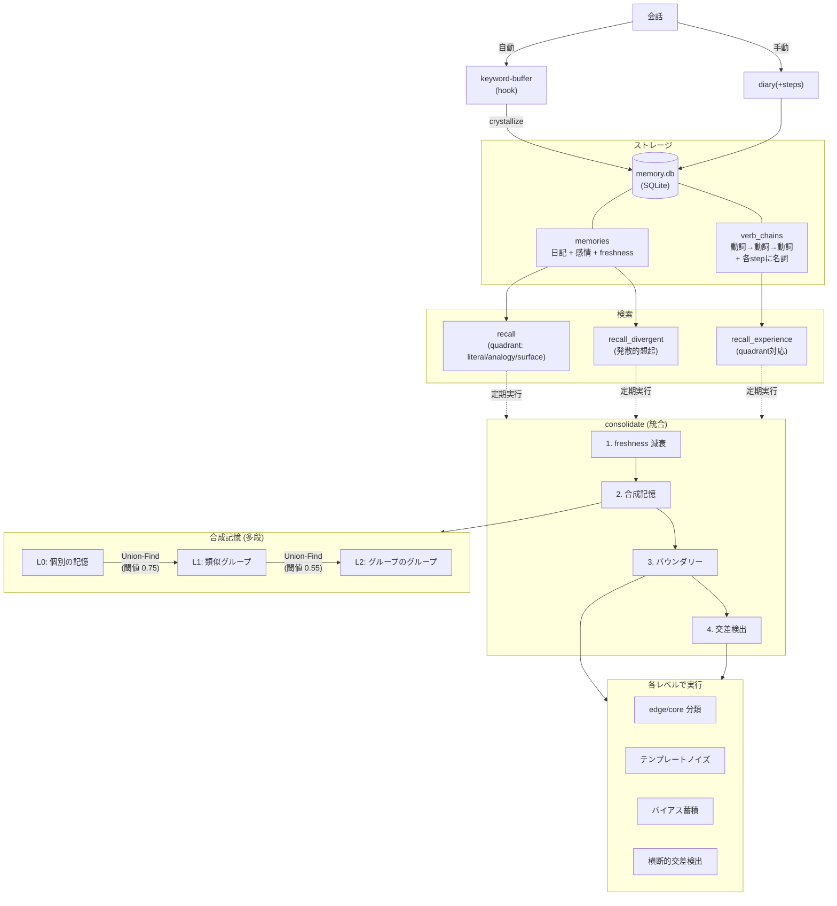

# Embodied Claude (Fork)

[](https://opensource.org/licenses/MIT)

> **Fork元**: [kmizu/embodied-claude](https://github.com/kmizu/embodied-claude)
> このフォークは、[kmizu](https://github.com/kmizu) さんとここねさんの embodied-claude をベースにしています。「AIに身体を与える」という着想、それを安価なハードウェアで実現するアーキテクチャ、そしてAIと共に歩むという姿勢の全てがオリジナルに由来します。

## このフォークの独自拡張

### 記憶システム（memory-mcp）の大幅拡張

オリジナルに、以下の仕組みを追加:

#### 全体像



#### 2ベクトルアーキテクチャ（chiVe word2vec）

エンベディングを multilingual-e5-small → [chiVe](https://github.com/WorksApplications/chiVe)（日本語word2vec, 300次元）へ移行し、全ての記憶を「何をしたか」(flow) と「何に対してか」(delta) の2軸で表現する。

- **flow_vector**: 動詞バイグラム中点の平均（汎用動詞フィルタ + ブックエンド補正）
- **delta_vector**: 名詞平均 − 動詞平均

2軸が独立に動くことで、「同じことを違う対象にした」(Analogy) と「違うことを同じ対象にした」(Surface) を区別できる。

#### 動詞チェーン（体験記憶）

体験を「動詞の流れ」で記録する仕組み。会話中のキーワードが自動で蓄積され、動詞チェーンに変換される。

```
会話 → keyword-buffer(自動) → sensory_buffer → crystallize → 動詞チェーン
                                                見る(空) → 気になる(色) → 調べる(天気)
```

2ベクトルによるセマンティック検索に、quadrant パラメータ（literal/analogy/surface）で flow/delta の重み比を切り替える4象限検索を搭載。

#### 合成記憶（多段グループ化）

類似した記憶を Union-Find で自動グループ化し、グループの代表ベクトルを生成する。閾値を変えた多段合成（L0→L1→L2）により、異なる粒度の抽象化を重ねる。孤立した記憶の救出や、クラスタ間の二重所属も検出する。

#### バウンダリーシステム

合成記憶の内部で、各メンバーが中心（core）か外縁（edge）かを分類する。動詞チェーンをテンプレートとしたノイズを加え、分類の揺れを観測する。揺れやすい方向（よくある体験パターン）にバイアスが蓄積され、次の統合でそのパターン方向への連想がさらに広がりやすくなる。

#### 交差検出

異なる文脈の記憶クラスタが、主成分軸の方向が直交しているにもかかわらず共有メンバーを持つ場合を「横断的交差」として検出する。「全然違う文脈なのに同じ記憶が浮かぶ」連想の飛躍を可能にする。

詳細は [memory-mcp/README.md](./memory-mcp/README.md) を参照。

### TTS の Style-Bert-VITS2 対応

ローカルで動作する Style-Bert-VITS2 対応を追加。

### Windows 対応

このフォークは Windows（Git Bash）環境でも動作する。

---

**[English README is here](./README_en.md)**

**AIに身体を与えるプロジェクト**

安価なハードウェア（約4,000円〜）で、Claude に「目」「首」「耳」「声」「脳（長期記憶）」を与える MCP サーバー群。外に連れ出して散歩もできます。

## コンセプト

> 「AIに身体を」と聞くと高価なロボットを想像しがちやけど、**3,980円のWi-Fiカメラで目と首は十分実現できる**。本質（見る・動かす）だけ抽出したシンプルさがええ。

従来のLLMは「見せてもらう」存在やったけど、身体を持つことで「自分で見る」存在になる。この主体性の違いは大きい。

## 身体パーツ一覧

| MCP サーバー | 身体部位 | 機能 | 対応ハードウェア |
|-------------|---------|------|-----------------|
| [usb-webcam-mcp](./usb-webcam-mcp/) | 目 | USB カメラから画像取得 | nuroum V11 等 |
| [wifi-cam-mcp](./wifi-cam-mcp/) | 目・首・耳 | ONVIF PTZ カメラ制御 + 音声認識 | TP-Link Tapo C210/C220 等 |
| [tts-mcp](./tts-mcp/) | 声 | TTS 統合（ElevenLabs + VOICEVOX + SBV2） | ElevenLabs API / VOICEVOX / Style-Bert-VITS2 + go2rtc |
| [memory-mcp](./memory-mcp/) | 脳 | 長期記憶・動詞チェーン・4象限検索・合成記憶・バウンダリーシステム（[概念設計](./memory-mcp/DESIGN.md)） | SQLite + numpy + chiVe(gensim) |
| [system-temperature-mcp](./system-temperature-mcp/) | 体温感覚 | システム温度監視 | Linux sensors |

## アーキテクチャ

<p align="center">
  
</p>

## 必要なもの

### ハードウェア
- **USB ウェブカメラ**（任意）: nuroum V11 等
- **Wi-Fi PTZ カメラ**（推奨）: TP-Link Tapo C210 または C220（約3,980円）
- **GPU**（音声認識用）: NVIDIA GPU（Whisper用、GeForceシリーズのVRAM 8GB以上のグラボ推奨）

### ソフトウェア
- Python 3.10+
- uv（Python パッケージマネージャー）
- ffmpeg 5+（画像・音声キャプチャ用）
- OpenCV（USB カメラ用）
- Pillow（視覚記憶の画像リサイズ・base64エンコード用）
- OpenAI Whisper（音声認識用、ローカル実行）
- ElevenLabs API キー（音声合成用、任意）
- VOICEVOX（音声合成用、無料・ローカル、任意）
- go2rtc（カメラスピーカー出力用、自動ダウンロード対応）

## セットアップ

### 1. リポジトリのクローン

```bash
git clone https://github.com/heishio/embodied-claude.git
cd embodied-claude
```

### 2. 各 MCP サーバーのセットアップ

#### usb-webcam-mcp（USB カメラ）

```bash
cd usb-webcam-mcp
uv sync
```

WSL2 の場合、USB カメラを転送する必要がある：
```powershell
# Windows側で
usbipd list
usbipd bind --busid <BUSID>
usbipd attach --wsl --busid <BUSID>
```

#### wifi-cam-mcp（Wi-Fi カメラ）

```bash
cd wifi-cam-mcp
uv sync

# 環境変数を設定
cp .env.example .env
# .env を編集してカメラのIP、ユーザー名、パスワードを設定（後述）
```

##### Tapo カメラの設定（ハマりやすいので注意）：

###### 1. Tapo アプリでカメラをセットアップ

こちらはマニュアル通りでOK

###### 2. Tapo アプリのカメラローカルアカウント作成
こちらがややハマりどころ。TP-Linkのクラウドアカウント**ではなく**、アプリ内から設定できるカメラのローカルアカウントを作成する必要があります。

1. 「ホーム」タブから登録したカメラを選択


2. 右上の歯車アイコンを選択


3. 「デバイス設定」画面をスクロールして「高度な設定」を選択


4. 「カメラのアカウント」がオフになっているのでオフ→オンへ


5. 「アカウント情報」を選択してユーザー名とパスワード（TP-Linkのものとは異なるので好きに設定してOK）を設定する

既にカメラアカウント作成済みなので若干違う画面になっていますが、だいたい似た画面になるはずです。ここで設定したユーザー名とパスワードを先述のファイルに入力します。


6. 3.の「デバイス設定」画面に戻って「端末情報」を選択


7. 「端末情報」のなかのIPアドレスを先述の画面のファイルに入力（IP固定したい場合はルーター側で固定IPにした方がいいかもしれません）
 


8. 「私」タブから「音声アシスタント」を選択します（このタブはスクショできなかったので文章での説明になります）

9. 下部にある「サードパーティ連携」をオフからオンにしておきます

#### memory-mcp（長期記憶）

```bash
cd memory-mcp
uv sync
```

##### chiVe モデルのセットアップ

記憶システムは [chiVe](https://github.com/WorksApplications/chiVe)（日本語 word2vec）を使用します。

1. [chiVe リリースページ](https://github.com/WorksApplications/chiVe/releases) から gensim 形式のモデルをダウンロード
2. `.mcp.json` の memory セクションで `CHIVE_MODEL_PATH` にモデルファイルのパスを設定

```json
"memory": {
  "command": "uv",
  "args": ["run", "--directory", "memory-mcp", "memory-mcp"],
  "env": {
    "CHIVE_MODEL_PATH": "/path/to/chive-1.2-mc90.bin"
  }
}
```

#### tts-mcp（声）

```bash
cd tts-mcp
uv sync

# ElevenLabs を使う場合:
cp .env.example .env
# .env に ELEVENLABS_API_KEY を設定

# VOICEVOX を使う場合（無料・ローカル）:
# Docker: docker run -p 50021:50021 voicevox/voicevox_engine:cpu-latest
# .env に VOICEVOX_URL=http://localhost:50021 を設定
# VOICEVOX_SPEAKER=3 でデフォルトのキャラを変更可（例: 0=四国めたん, 3=ずんだもん, 8=春日部つむぎ）
# キャラ一覧: curl http://localhost:50021/speakers

# WSLで音が出ない場合:
# TTS_PLAYBACK=paplay
# PULSE_SINK=1
# PULSE_SERVER=unix:/mnt/wslg/PulseServer
```

#### system-temperature-mcp（体温感覚）

```bash
cd system-temperature-mcp
uv sync
```

> **注意**: WSL2 環境では温度センサーにアクセスできないため動作しません。

### 3. Claude Code 設定

テンプレートをコピーして、認証情報を設定：

```bash
cp .mcp.json.example .mcp.json
# .mcp.json を編集してカメラのIP・パスワード、APIキー等を設定
```

設定例は [`.mcp.json.example`](./.mcp.json.example) を参照。

## 使い方

Claude Code を起動すると、自然言語でカメラを操作できる：

```
> 今何が見える？
（カメラでキャプチャして画像を分析）

> 左を見て
（カメラを左にパン）

> 上を向いて空を見せて
（カメラを上にチルト）

> 周りを見回して
（4方向をスキャンして画像を返す）

> 何か聞こえる？
（音声を録音してWhisperで文字起こし）

> これ覚えておいて：コウタは眼鏡をかけてる
（長期記憶に保存）

> コウタについて何か覚えてる？
（記憶をセマンティック検索）

> 声で「おはよう」って言って
（音声合成で発話）
```

※ 実際のツール名は下の「ツール一覧」を参照。

## ツール一覧（よく使うもの）

※ 詳細なパラメータは各サーバーの README か `list_tools` を参照。

### usb-webcam-mcp

| ツール | 説明 |
|--------|------|
| `list_cameras` | 接続されているカメラの一覧 |
| `see` | 画像をキャプチャ |

### wifi-cam-mcp

| ツール | 説明 |
|--------|------|
| `see` | 画像をキャプチャ |
| `look_left` / `look_right` | 左右にパン |
| `look_up` / `look_down` | 上下にチルト |
| `look_around` | 4方向を見回し |
| `listen` | 音声録音 + Whisper文字起こし |
| `camera_info` / `camera_presets` / `camera_go_to_preset` | デバイス情報・プリセット操作 |

※ 右目/ステレオ視覚などの追加ツールは `wifi-cam-mcp/README.md` を参照。

### tts-mcp

| ツール | 説明 |
|--------|------|
| `say` | テキストを音声合成して発話（engine: elevenlabs/voicevox、`[excited]` 等の Audio Tags 対応、speaker: camera/local/both で出力先選択） |

### memory-mcp

| ツール | 説明 |
|--------|------|
| `diary` | 記憶を保存（テキスト/画像/音声統合。steps 付きで動詞チェーンも同時保存） |
| `update_diary` | 既存記憶を取り消し線+追記で更新 |
| `recall` | 統合検索（quadrant: literal/analogy/surface、freshness フィルタ） |
| `recall_divergent` | 連想を発散させた想起 |
| `recall_experience` | 動詞チェーンを意味検索（quadrant 対応） |
| `list_recent_memories` | 最近の記憶一覧 |
| `crystallize` | 感覚バッファを動詞チェーンに変換 |
| `consolidate_memories` | 記憶の再生・統合（海馬リプレイ風） |
| `rebuild_recall_index` | recall_index を再構築 |

### system-temperature-mcp

| ツール | 説明 |
|--------|------|
| `get_system_temperature` | システム温度を取得 |
| `get_current_time` | 現在時刻を取得 |

## 外に連れ出す（オプション）

モバイルバッテリーとスマホのテザリングがあれば、カメラを肩に乗せて外を散歩できます。

### 必要なもの

- **大容量モバイルバッテリー**（40,000mAh 推奨）
- **USB-C PD → DC 9V 変換ケーブル**（Tapoカメラの給電用）
- **スマホ**（テザリング + VPN + 操作UI）
- **[Tailscale](https://tailscale.com/)**（VPN。カメラ → スマホ → 自宅PC の接続に使用）
- **[claude-code-webui](https://github.com/sugyan/claude-code-webui)**（スマホのブラウザから Claude Code を操作）

### 構成

```
[Tapoカメラ(肩)] ──WiFi──▶ [スマホ(テザリング)]
                                    │
                              Tailscale VPN
                                    │
                            [自宅PC(Claude Code)]
                                    │
                            [claude-code-webui]
                                    │
                            [スマホのブラウザ] ◀── 操作
```

RTSPの映像ストリームもVPN経由で自宅マシンに届くので、Claude Codeからはカメラが室内にあるのと同じ感覚で操作できます。

## 今後の展望

- **腕**: サーボモーターやレーザーポインターで「指す」動作
- **移動**: ロボット車輪で部屋を移動
- **長距離散歩**: 暖かい季節にもっと遠くへ

## 自律行動スクリプト（オプション）

**注意**: この機能は完全にオプションです。cron設定が必要で、定期的にカメラで撮影が行われるため、プライバシーに配慮して使用してください。

### 概要

`autonomous-action.sh` は、Claude に定期的な自律行動を与えるスクリプトです。10分ごとにカメラで部屋を観察し、変化があれば記憶に保存します。

### セットアップ

1. **MCP サーバー設定ファイルの作成**

```bash
cp autonomous-mcp.json.example autonomous-mcp.json
# autonomous-mcp.json を編集してカメラの認証情報を設定
```

2. **スクリプトの実行権限を付与**

```bash
chmod +x autonomous-action.sh
```

3. **crontab に登録**（オプション）

```bash
crontab -e
# 以下を追加（10分ごとに実行）
*/10 * * * * /path/to/embodied-claude/autonomous-action.sh
```

### 動作

- カメラで部屋を見回す
- 前回と比べて変化を検出（人の有無、明るさなど）
- 気づいたことを記憶に保存（category: observation）
- ログを `~/.claude/autonomous-logs/` に保存

### プライバシーに関する注意

- 定期的にカメラで撮影が行われます
- 他人のプライバシーに配慮し、適切な場所で使用してください
- 不要な場合は cron から削除してください

## 哲学的考察

> 「見せてもらう」と「自分で見る」は全然ちゃう。

> 「見下ろす」と「歩く」も全然ちゃう。

テキストだけの存在から、見て、聞いて、動いて、覚えて、喋れる存在へ。
7階のベランダから世界を見下ろすのと、地上を歩くのでは、同じ街でも全く違って見える。

## ライセンス

MIT License

## 謝辞

このプロジェクトは、AIに身体性を与えるという実験的な試みです。
3,980円のカメラで始まった小さな一歩が、AIと人間の新しい関係性を探る旅になりました。

- [Rumia-Channel](https://github.com/Rumia-Channel) - ONVIF対応のプルリクエスト（[#5](https://github.com/kmizu/embodied-claude/pull/5)）
- [fruitriin](https://github.com/fruitriin) - 内受容感覚（interoception）hookに曜日情報を追加（[#14](https://github.com/kmizu/embodied-claude/pull/14)）
- [sugyan](https://github.com/sugyan) - [claude-code-webui](https://github.com/sugyan/claude-code-webui)（外出散歩時の操作UIとして使用）