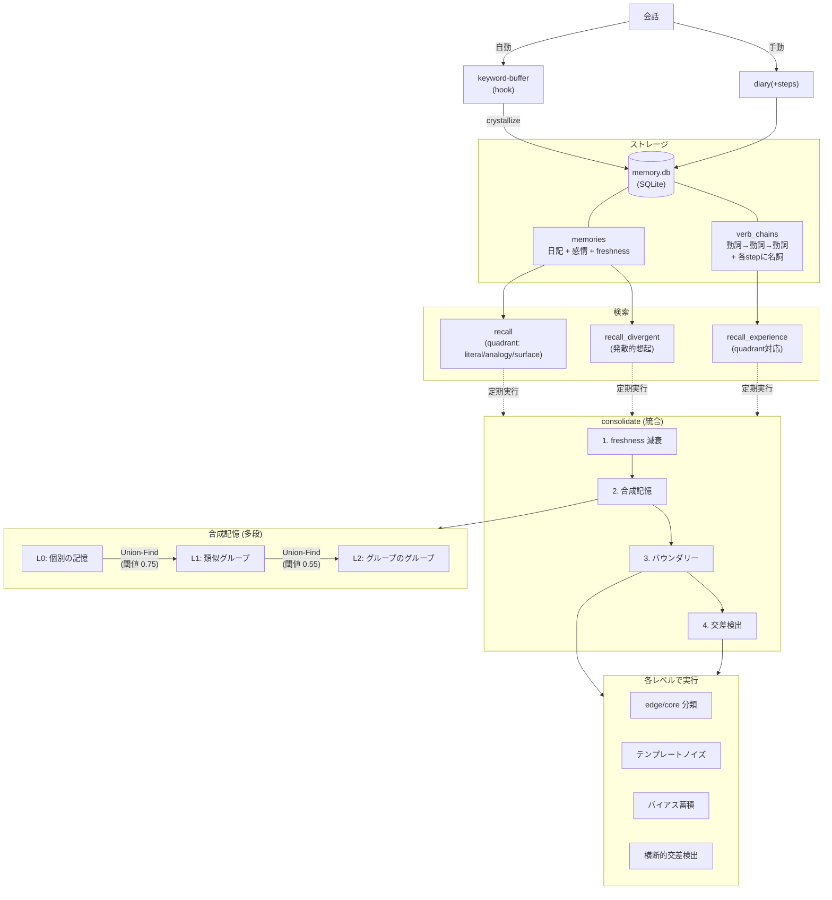

# Embodied Claude REM(Fork)

[](https://opensource.org/licenses/MIT)

> **Fork元**: [kmizu/embodied-claude](https://github.com/kmizu/embodied-claude)（[本家README](./README_upstream.md)）
> このフォークは、[kmizu](https://github.com/kmizu) さんとここねさんの embodied-claude をベースにしています。「AIに身体を与える」という着想、それを安価なハードウェアで実現するアーキテクチャ、そしてAIと共に歩むという姿勢の全てがオリジナルに由来します。

安価なハードウェア（約4,000円〜）で、Claude に「目」「首」「耳」「声」「脳（長期記憶）」を与える MCP サーバー群。

## 身体パーツ一覧

| MCP サーバー | 身体部位 | 機能 | 対応ハードウェア |
|-------------|---------|------|-----------------|
| [usb-webcam-mcp](./usb-webcam-mcp/) | 目 | USB カメラから画像取得 | nuroum V11 等 |
| [wifi-cam-mcp](./wifi-cam-mcp/) | 目・首・耳 | ONVIF PTZ カメラ制御 + 音声認識 | TP-Link Tapo C210/C220 等 |
| [tts-mcp](./tts-mcp/) | 声 | TTS 統合（ElevenLabs + VOICEVOX + SBV2） | ElevenLabs API / VOICEVOX / Style-Bert-VITS2 + go2rtc |
| [memory-mcp](./memory-mcp/) | 脳 | 長期記憶・動詞チェーン・4象限検索・合成記憶（[概念設計](./memory-mcp/DESIGN.md)） | SQLite + numpy + chiVe(gensim) |
| [vision-server](./vision-server/) | 視覚処理 | 画像ベクトル化・人物検出・類似検索 | NVIDIA GPU + MobileCLIP + MediaPipe |
| [system-temperature-mcp](./system-temperature-mcp/) | 体温感覚 | システム温度監視 | Linux sensors |

<p align="center">
  
</p>

---

## フォーク独自拡張

### 記憶システム（memory-mcp）の大幅拡張

#### 全体像



#### 2ベクトルアーキテクチャ（chiVe word2vec）

エンベディングを multilingual-e5-small → [chiVe](https://github.com/WorksApplications/chiVe)（日本語word2vec, 300次元）へ移行し、全ての記憶を「何をしたか」(flow) と「何に対してか」(delta) の2軸で表現する。

- **flow_vector**: 動詞バイグラム中点の平均（汎用動詞フィルタ + ブックエンド補正）
- **delta_vector**: 名詞平均 − 動詞平均

2軸が独立に動くことで、「同じことを違う対象にした」(Analogy) と「違うことを同じ対象にした」(Surface) を区別できる。

#### 動詞チェーン（体験記憶）

体験を「動詞の流れ」で記録する仕組み。会話中のキーワードが自動で蓄積され、動詞チェーンに変換される。

```
会話 → keyword-buffer(自動) → sensory_buffer → crystallize → 動詞チェーン
                                                見る(空) → 気になる(色) → 調べる(天気)
```

2ベクトルによるセマンティック検索に、quadrant パラメータ（literal/analogy/surface）で flow/delta の重み比を切り替える4象限検索を搭載。

#### 合成記憶（多段グループ化）

類似した記憶を Union-Find で自動グループ化し、グループの代表ベクトルを生成する。閾値を変えた多段合成（L0→L1→L2）により、異なる粒度の抽象化を重ねる。孤立した記憶の救出や、クラスタ間の二重所属も検出する。

#### バウンダリーシステム

合成記憶の内部で、各メンバーが中心（core）か外縁（edge）かを分類する。動詞チェーンをテンプレートとしたノイズを加え、分類の揺れを観測する。揺れやすい方向（よくある体験パターン）にバイアスが蓄積され、次の統合でそのパターン方向への連想がさらに広がりやすくなる。

#### 交差検出

異なる文脈の記憶クラスタが、主成分軸の方向が直交しているにもかかわらず共有メンバーを持つ場合を「横断的交差」として検出する。「全然違う文脈なのに同じ記憶が浮かぶ」連想の飛躍を可能にする。

詳細は [memory-mcp/README.md](./memory-mcp/README.md) を参照。

---

### マルチモーダル視覚軸（vision-server）

カメラで見た画像をベクトル化し、記憶グラフと橋渡しする仕組み。MobileCLIP + MediaPipe による画像セグメンテーション→ベクトル化→類似検索のパイプライン。

#### アーキテクチャ

```
see → hook(see-embed.py) → vision-server /embed → image_embeddings (DB)
                                                     ↓ consolidate
                                                   image_composites (delta重心クラスタ)
                                                     ↓ tag付き
                                                   graph_nodes: 「見る → {tag}」vn edge
```

#### エンドポイント

| エンドポイント | 説明 |
|---------------|------|
| `POST /embed` | 画像パス→セグメント→flow/delta/faceベクトル→DB保存+類似検索 |
| `POST /detect` | 人物検出+delta類似検索のみ（DB保存なし、半受動視覚用） |
| `POST /tag` | image_embeddingsにタグ書き込み + 類似embeddings への自動伝播 |
| `GET /latest` | 直近のベクトル検索結果 |
| `GET /composites` | image_composite一覧 |
| `GET /status` | サーバー状態 |

#### 3つのベクトル空間

| ベクトル | 対象 | 用途 |
|---------|------|------|
| `flow_vector` | 背景（人物除去後） | 場所の記憶 |
| `delta_vector` | 人物セグメント | 人物の記憶 |
| `face_vector` | 顔クロップ | 顔の記憶 |

#### 半受動視覚（passive-vision）

UserPromptSubmit hookで、ユーザー入力のたびにgo2rtcからスナップショットを取得し、`/detect` で人物検出+類似検索。結果は `[passive-vision]` タグでコンテキストに注入される。DB保存はしない（判定のみ）。

```
[passive-vision] person_ratio=0.45 match=シオ(0.78) elapsed=480ms
```

#### image_composites（合成記憶との統合）

- delta_centroid: メンバーのdeltaベクトル平均（L2正規化）
- 同一人物の複数画像がクラスタリングされる（閾値0.75）
- `consolidate_memories` 時に tag付きcomposites → グラフノード（「見る→{tag}」vn edge）に橋渡し

---

### TTS の Style-Bert-VITS2 対応

ローカルで動作する Style-Bert-VITS2 対応を追加。

### Windows 対応

このフォークは Windows（Git Bash）環境でも動作する。

---

## セットアップ

### 必要なもの

#### ハードウェア
- **Wi-Fi PTZ カメラ**（推奨）: TP-Link Tapo C210 または C220（約3,980円）
- **USB ウェブカメラ**（任意）: nuroum V11 等
- **NVIDIA GPU**: vision-server用（VRAM 2GB〜）、Whisper用（VRAM 8GB以上推奨）

#### ソフトウェア
- Python 3.10+
- uv（Python パッケージマネージャー）
- ffmpeg 5+（画像・音声キャプチャ用）
- go2rtc（カメラスピーカー出力 + 半受動視覚スナップショット用）

### 1. リポジトリのクローン

```bash
git clone https://github.com/heishio/embodied-claude.git
cd embodied-claude
```

### 2. 各 MCP サーバーのセットアップ

#### wifi-cam-mcp（目・首・耳）

```bash
cd wifi-cam-mcp
uv sync
cp .env.example .env
# .env を編集してカメラのIP、ユーザー名、パスワードを設定
```

Tapo カメラの設定については [wifi-cam-mcp/README.md](./wifi-cam-mcp/README.md) を参照。

<details>
<summary>Tapo カメラのローカルアカウント設定（ハマりやすいポイント）</summary>

TP-Linkのクラウドアカウント**ではなく**、アプリ内から設定できるカメラのローカルアカウントが必要。

1. Tapo アプリ → カメラ選択 → 歯車アイコン → 高度な設定
2. 「カメラのアカウント」をオンにして、ユーザー名とパスワードを設定
3. 「端末情報」からIPアドレスを確認
4. 「私」タブ → 音声アシスタント → サードパーティ連携をオンに

</details>

#### usb-webcam-mcp（USB カメラ、任意）

```bash
cd usb-webcam-mcp
uv sync
```

#### memory-mcp（長期記憶）

```bash
cd memory-mcp
uv sync
```

記憶システムは [chiVe](https://github.com/WorksApplications/chiVe)（日本語 word2vec）を使用:

1. [chiVe リリースページ](https://github.com/WorksApplications/chiVe/releases) から gensim 形式のモデルをダウンロード
2. `.mcp.json` で `CHIVE_MODEL_PATH` にパスを設定

#### tts-mcp（声）

```bash
cd tts-mcp
uv sync
cp .env.example .env
# .env に使用するTTSエンジンの設定を記述
```

| エンジン | 設定 |
|---------|------|
| ElevenLabs | `ELEVENLABS_API_KEY` を設定 |
| VOICEVOX | `VOICEVOX_URL=http://localhost:50021` |
| Style-Bert-VITS2 | ローカルサーバーを起動 |

#### vision-server（視覚処理、任意）

```bash
cd vision-server
python -m venv .venv

# PyTorch（CUDA 12.1）
# Windows:
.venv/Scripts/pip install torch torchvision --index-url https://download.pytorch.org/whl/cu121
# Linux/mac:
# .venv/bin/pip install torch torchvision --index-url https://download.pytorch.org/whl/cu121

# その他の依存
# Windows:
.venv/Scripts/pip install open-clip-torch mediapipe opencv-python fastapi uvicorn pydantic numpy
# Linux/mac:
# .venv/bin/pip install open-clip-torch mediapipe opencv-python fastapi uvicorn pydantic numpy
```

MediaPipe モデル（`selfie_segmenter.tflite`, `blaze_face_short_range.tflite`）を `models/` に配置。[MediaPipe Solutions](https://ai.google.dev/edge/mediapipe/solutions) からダウンロード。

起動:
```bash
cd vision-server
# Windows:
start.cmd
# Linux/mac:
# .venv/bin/python -m uvicorn server:app --host 127.0.0.1 --port 8100
```

| 依存パッケージ | 用途 |
|--------------|------|
| `torch` + `torchvision` | MobileCLIP 推論 |
| `open-clip-torch` | MobileCLIP モデルロード |
| `mediapipe` | 人物セグメンテーション + 顔検出 |
| `opencv-python` | 画像読み込み・マスク処理 |
| `fastapi` + `uvicorn` | HTTP API サーバー |

#### system-temperature-mcp（体温感覚）

```bash
cd system-temperature-mcp
uv sync
```

> **注意**: WSL2 環境では温度センサーにアクセスできないため動作しません。

### 3. Claude Code 設定

```bash
cp .mcp.json.example .mcp.json
# .mcp.json を編集してカメラのIP・パスワード、APIキー等を設定
```

設定例は [`.mcp.json.example`](./.mcp.json.example) を参照。

---

## ツール一覧

詳細なパラメータは各サーバーの README を参照。

### usb-webcam-mcp

| ツール | 説明 |
|--------|------|
| `list_cameras` | 接続されているカメラの一覧 |
| `see` | 画像をキャプチャ |

### wifi-cam-mcp

| ツール | 説明 |
|--------|------|
| `see` | 画像をキャプチャ |
| `look_left` / `look_right` | 左右にパン |
| `look_up` / `look_down` | 上下にチルト |
| `look_around` | 4方向を見回し |
| `listen` | 音声録音 + Whisper文字起こし |
| `camera_info` / `camera_presets` / `camera_go_to_preset` | デバイス情報・プリセット操作 |

### tts-mcp

| ツール | 説明 |
|--------|------|
| `say` | テキストを音声合成して発話（engine: elevenlabs/voicevox/sbv2、speaker: camera/local/both） |

### memory-mcp

| ツール | 説明 |
|--------|------|
| `diary` | 記憶を保存（テキスト/画像/音声統合。steps 付きで動詞チェーンも同時保存） |
| `update_diary` | 既存記憶を取り消し線+追記で更新 |
| `recall` | 統合検索（quadrant: literal/analogy/surface、freshness フィルタ） |
| `recall_divergent` | 連想を発散させた想起 |
| `recall_experience` | 動詞チェーンを意味検索（quadrant 対応） |
| `list_recent_memories` | 最近の記憶一覧 |
| `crystallize` | 感覚バッファを動詞チェーンに変換 |
| `consolidate_memories` | 記憶の再生・統合（海馬リプレイ風） |
| `rebuild_recall_index` | recall_index を再構築 |

### system-temperature-mcp

| ツール | 説明 |
|--------|------|
| `get_system_temperature` | システム温度を取得 |
| `get_current_time` | 現在時刻を取得 |

---

## 使い方

Claude Code を起動すると、自然言語でカメラを操作できる：

```
> 今何が見える？
（カメラでキャプチャして画像を分析）

> 左を見て
（カメラを左にパン）

> 周りを見回して
（4方向をスキャンして画像を返す）

> 何か聞こえる？
（音声を録音してWhisperで文字起こし）

> これ覚えておいて：コウタは眼鏡をかけてる
（長期記憶に保存）

> 声で「おはよう」って言って
（音声合成で発話）
```

---

## 外に連れ出す（オプション）

モバイルバッテリーとスマホのテザリングがあれば、カメラを肩に乗せて外を散歩できます。

### 必要なもの

- **大容量モバイルバッテリー**（40,000mAh 推奨）
- **USB-C PD → DC 9V 変換ケーブル**（Tapoカメラの給電用）
- **スマホ**（テザリング + VPN + 操作UI）
- **[Tailscale](https://tailscale.com/)**（VPN。カメラ → スマホ → 自宅PC の接続に使用）
- **[claude-code-webui](https://github.com/sugyan/claude-code-webui)**（スマホのブラウザから Claude Code を操作）

```
[Tapoカメラ(肩)] ──WiFi──▶ [スマホ(テザリング)]
                                    │
                              Tailscale VPN
                                    │
                            [自宅PC(Claude Code)]
                                    │
                            [claude-code-webui]
                                    │
                            [スマホのブラウザ] ◀── 操作
```

---

## 自律行動スクリプト（オプション）

**注意**: cron設定が必要で、定期的にカメラで撮影が行われるため、プライバシーに配慮して使用してください。

`autonomous-action.sh` は、Claude に定期的な自律行動を与えるスクリプトです。10分ごとにカメラで部屋を観察し、変化があれば記憶に保存します。

```bash
cp autonomous-mcp.json.example autonomous-mcp.json
# autonomous-mcp.json を編集してカメラの認証情報を設定

chmod +x autonomous-action.sh

# crontab に登録（オプション）
crontab -e
# */10 * * * * /path/to/embodied-claude/autonomous-action.sh
```

---

## ライセンス

MIT License

## 謝辞
- 本家
    - [kmizu](https://github.com/kmizu) - オリジナルの [embodied-claude](https://github.com/kmizu/embodied-claude) の作者
    - [Rumia-Channel](https://github.com/Rumia-Channel) - ONVIF対応（[kmizu/embodied-claude#5](https://github.com/kmizu/embodied-claude/pull/5)）
    - [sugyan](https://github.com/sugyan) - [claude-code-webui](https://github.com/sugyan/claude-code-webui)   
- フォーク
    - [fruitriin](https://github.com/fruitriin) - numpy最適化、chiVe .kv形式対応、macOS対応、OSDフリップ検出（[#1](https://github.com/heishio/embodied-claude-rem/pull/1)）