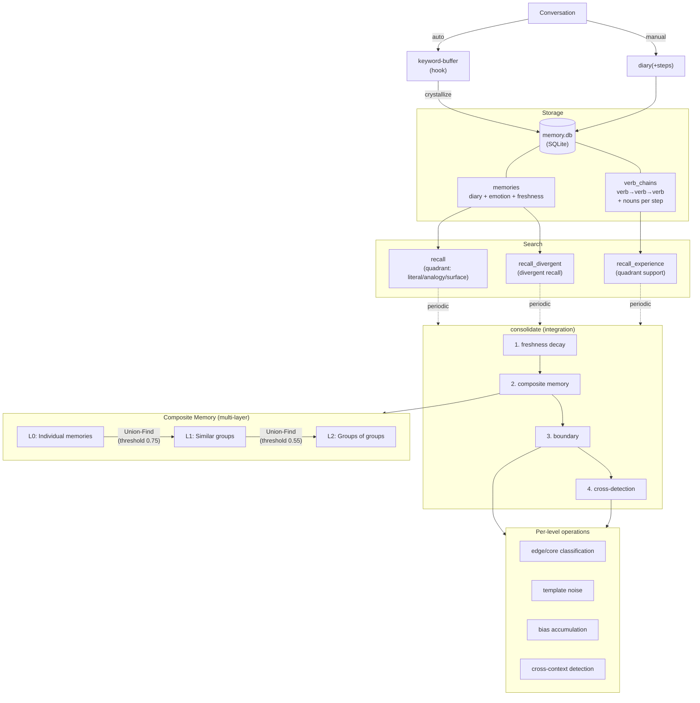

# Embodied Claude REM (Fork)

[](https://opensource.org/licenses/MIT)

> **Forked from**: [kmizu/embodied-claude](https://github.com/kmizu/embodied-claude) ([upstream README](./README_upstream.md))
> This fork is based on embodied-claude by [kmizu](https://github.com/kmizu) and Kokone. The concept of giving AI a body, the architecture that realizes it with affordable hardware, and the ethos of walking alongside AI — all originate from the original project.

A collection of MCP servers that give Claude "eyes", "neck", "ears", "voice", and a "brain" (long-term memory) using affordable hardware (starting from ~$30).

## Body Parts

| MCP Server | Body Part | Function | Hardware |
|------------|-----------|----------|----------|
| [usb-webcam-mcp](./usb-webcam-mcp/) | Eyes | Capture images from USB camera | nuroum V11 etc. |
| [wifi-cam-mcp](./wifi-cam-mcp/) | Eyes, Neck, Ears | ONVIF PTZ camera control + speech recognition | TP-Link Tapo C210/C220 etc. |
| [tts-mcp](./tts-mcp/) | Voice | Unified TTS (ElevenLabs + VOICEVOX + SBV2) | ElevenLabs API / VOICEVOX / Style-Bert-VITS2 + go2rtc |
| [memory-mcp](./memory-mcp/) | Brain | Long-term memory, verb chains, quadrant search, composite memory ([design doc](./memory-mcp/DESIGN.md)) | SQLite + numpy + chiVe(gensim) |
| [vision-server](./vision-server/) | Visual Processing | Image vectorization, person detection, similarity search | NVIDIA GPU + MobileCLIP + MediaPipe |
| [system-temperature-mcp](./system-temperature-mcp/) | Body Temperature | System temperature monitoring | Linux sensors |

<p align="center">
  
</p>

---

## Fork Extensions

### Memory System (memory-mcp) — Major Expansion

#### Overview



#### 2-Vector Architecture (chiVe word2vec)

Migrated embeddings from multilingual-e5-small to [chiVe](https://github.com/WorksApplications/chiVe) (Japanese word2vec, 300 dimensions). Every memory is represented along two axes: "what was done" (flow) and "to/about what" (delta).

- **flow_vector**: Mean of verb bigram midpoints (generic verb filter + bookend correction)
- **delta_vector**: Noun mean − verb mean

The two independent axes distinguish "same action on different targets" (Analogy) from "different actions on the same target" (Surface).

#### Verb Chains (Experience Memory)

Records experiences as "flows of verbs." Keywords are automatically accumulated during conversation and converted into verb chains.

```
Conversation → keyword-buffer(auto) → sensory_buffer → crystallize → verb chain
                                                        see(sky) → wonder(color) → look_up(weather)
```

Features 4-quadrant search with a `quadrant` parameter (literal/analogy/surface) that adjusts flow/delta weight ratios.

#### Composite Memory (Multi-layer Grouping)

Similar memories are auto-grouped via Union-Find, generating representative vectors for each group. Multi-layer synthesis (L0→L1→L2) with different thresholds enables abstraction at various granularities. Includes rescue of isolated memories and detection of dual-membership across clusters.

#### Boundary System

Classifies each member within composite memory as core or edge. Adds noise using verb chain templates and observes classification fluctuations. Bias accumulates in directions that fluctuate easily (common experience patterns), making associative expansion in those directions easier in subsequent consolidation.

#### Cross-Detection

Detects "cross-context intersections" where memory clusters with orthogonal principal component axes share common members. Enables associative leaps — "completely different contexts yet the same memory surfaces."

See [memory-mcp/README.md](./memory-mcp/README.md) for details.

---

### Multimodal Visual Axis (vision-server)

Vectorizes camera images and bridges them to the memory graph. Pipeline: MobileCLIP + MediaPipe image segmentation → vectorization → similarity search.

#### Architecture

```
see → hook(see-embed.py) → vision-server /embed → image_embeddings (DB)
                                                     ↓ consolidate
                                                   image_composites (delta centroid clusters)
                                                     ↓ tagged
                                                   graph_nodes: "see → {tag}" vn edge
```

#### Endpoints

| Endpoint | Description |
|----------|-------------|
| `POST /embed` | Image path → segment → flow/delta/face vectors → DB save + similarity search |
| `POST /detect` | Person detection + delta similarity search only (no DB save, for passive vision) |
| `POST /tag` | Write tag to image_embeddings + auto-propagate to similar embeddings |
| `GET /latest` | Latest vector search results |
| `GET /composites` | image_composite list |
| `GET /status` | Server status |

#### 3 Vector Spaces

| Vector | Target | Purpose |
|--------|--------|---------|
| `flow_vector` | Background (person removed) | Location memory |
| `delta_vector` | Person segment | Person memory |
| `face_vector` | Face crop | Face memory |

#### Passive Vision

A UserPromptSubmit hook captures a go2rtc snapshot on every user input and runs person detection + similarity search via `/detect`. Results are injected into context as `[passive-vision]` tags. No DB save (detection only).

```
[passive-vision] person_ratio=0.45 match=Sio(0.78) elapsed=480ms
```

#### image_composites (Integration with Composite Memory)

- delta_centroid: L2-normalized mean of member delta vectors
- Multiple images of the same person are clustered (threshold 0.75)
- During `consolidate_memories`, tagged composites → graph nodes ("see→{tag}" vn edge)

---

### Style-Bert-VITS2 TTS Support

Added support for locally-running Style-Bert-VITS2.

### Windows Support

This fork works on Windows (Git Bash) environments.

---

## Setup

### Requirements

#### Hardware
- **Wi-Fi PTZ Camera** (recommended): TP-Link Tapo C210 or C220 (~$30)
- **USB Webcam** (optional): nuroum V11 etc.
- **NVIDIA GPU**: For vision-server (VRAM 2GB+), for Whisper (VRAM 8GB+ recommended)

#### Software
- Python 3.10+
- uv (Python package manager)
- ffmpeg 5+ (image/audio capture)
- go2rtc (camera speaker output + passive vision snapshots)

### 1. Clone the repository

```bash
git clone https://github.com/heishio/embodied-claude.git
cd embodied-claude
```

### 2. Set up each MCP server

#### wifi-cam-mcp (Eyes, Neck, Ears)

```bash
cd wifi-cam-mcp
uv sync
cp .env.example .env
# Edit .env to set camera IP, username, and password
```

See [wifi-cam-mcp/README.md](./wifi-cam-mcp/README.md) for Tapo camera configuration.

<details>
<summary>Tapo Camera Local Account Setup (common pitfall)</summary>

You need a **camera local account**, NOT a TP-Link cloud account.

1. Tapo app → Select camera → Gear icon → Advanced Settings
2. Turn on "Camera Account" and set username/password
3. Check the IP address in "Device Info"
4. "Me" tab → Voice Assistant → Turn on "Third-party Integration"

</details>

#### usb-webcam-mcp (USB Camera, optional)

```bash
cd usb-webcam-mcp
uv sync
```

#### memory-mcp (Long-term Memory)

```bash
cd memory-mcp
uv sync
```

The memory system uses [chiVe](https://github.com/WorksApplications/chiVe) (Japanese word2vec):

1. Download a gensim format model from the [chiVe releases page](https://github.com/WorksApplications/chiVe/releases)
2. Set `CHIVE_MODEL_PATH` in `.mcp.json`

#### tts-mcp (Voice)

```bash
cd tts-mcp
uv sync
cp .env.example .env
# Configure your TTS engine settings in .env
```

| Engine | Configuration |
|--------|--------------|
| ElevenLabs | Set `ELEVENLABS_API_KEY` |
| VOICEVOX | `VOICEVOX_URL=http://localhost:50021` |
| Style-Bert-VITS2 | Start local server |

#### vision-server (Visual Processing, optional)

```bash
cd vision-server
python -m venv .venv

# PyTorch (CUDA 12.1)
# Windows:
.venv/Scripts/pip install torch torchvision --index-url https://download.pytorch.org/whl/cu121
# Linux/mac:
# .venv/bin/pip install torch torchvision --index-url https://download.pytorch.org/whl/cu121

# Other dependencies
# Windows:
.venv/Scripts/pip install open-clip-torch mediapipe opencv-python fastapi uvicorn pydantic numpy
# Linux/mac:
# .venv/bin/pip install open-clip-torch mediapipe opencv-python fastapi uvicorn pydantic numpy
```

Place MediaPipe models (`selfie_segmenter.tflite`, `blaze_face_short_range.tflite`) in the `models/` directory. Download from [MediaPipe Solutions](https://ai.google.dev/edge/mediapipe/solutions).

Start:
```bash
cd vision-server
# Windows:
start.cmd
# Linux/mac:
# .venv/bin/python -m uvicorn server:app --host 127.0.0.1 --port 8100
```

| Dependency | Purpose |
|-----------|---------|
| `torch` + `torchvision` | MobileCLIP inference |
| `open-clip-torch` | MobileCLIP model loading |
| `mediapipe` | Person segmentation + face detection |
| `opencv-python` | Image loading & mask processing |
| `fastapi` + `uvicorn` | HTTP API server |

#### system-temperature-mcp (Body Temperature)

```bash
cd system-temperature-mcp
uv sync
```

> **Note**: Does not work on WSL2 as temperature sensors are not accessible.

### 3. Claude Code Configuration

```bash
cp .mcp.json.example .mcp.json
# Edit .mcp.json to set camera IP/password, API keys, etc.
```

See [`.mcp.json.example`](./.mcp.json.example) for the full configuration template.

---

## Tools

See each server's README for full parameter details.

### usb-webcam-mcp

| Tool | Description |
|------|-------------|
| `list_cameras` | List connected cameras |
| `see` | Capture an image |

### wifi-cam-mcp

| Tool | Description |
|------|-------------|
| `see` | Capture an image |
| `look_left` / `look_right` | Pan left/right |
| `look_up` / `look_down` | Tilt up/down |
| `look_around` | Scan 4 directions |
| `listen` | Record audio + Whisper transcription |
| `camera_info` / `camera_presets` / `camera_go_to_preset` | Device info & presets |

### tts-mcp

| Tool | Description |
|------|-------------|
| `say` | Text-to-speech (engine: elevenlabs/voicevox/sbv2, speaker: camera/local/both) |

### memory-mcp

| Tool | Description |
|------|-------------|
| `diary` | Save a memory (text/image/audio unified. With steps for verb chain co-saving) |
| `update_diary` | Update existing memory with strikethrough + amendment |
| `recall` | Unified search (quadrant: literal/analogy/surface, freshness filter) |
| `recall_divergent` | Divergent associative recall |
| `recall_experience` | Semantic search for verb chains (quadrant support) |
| `list_recent_memories` | Recent memories list |
| `crystallize` | Convert sensory buffer to verb chains |
| `consolidate_memories` | Memory replay & consolidation (hippocampal replay-inspired) |
| `rebuild_recall_index` | Rebuild recall_index |

### system-temperature-mcp

| Tool | Description |
|------|-------------|
| `get_system_temperature` | Get system temperature |
| `get_current_time` | Get current time |

---

## Usage

Once Claude Code is running, you can control the camera with natural language:

```
> What can you see?
(Captures image and analyzes it)

> Look left
(Pans camera left)

> Look around
(Scans 4 directions and returns images)

> What do you hear?
(Records audio and transcribes with Whisper)

> Remember this: Kouta wears glasses
(Saves to long-term memory)

> Say "good morning" out loud
(Text-to-speech)
```

---

## Taking It Outside (Optional)

With a mobile battery and smartphone tethering, you can mount the camera on your shoulder and go for a walk.

### What you need

- **Large capacity mobile battery** (40,000mAh recommended)
- **USB-C PD to DC 9V converter cable** (to power the Tapo camera)
- **Smartphone** (tethering + VPN + control UI)
- **[Tailscale](https://tailscale.com/)** (VPN for camera → phone → home PC connection)
- **[claude-code-webui](https://github.com/sugyan/claude-code-webui)** (control Claude Code from your phone's browser)

```
[Tapo Camera (shoulder)] ──WiFi──▶ [Phone (tethering)]
                                           │
                                     Tailscale VPN
                                           │
                                   [Home PC (Claude Code)]
                                           │
                                   [claude-code-webui]
                                           │
                                   [Phone browser] ◀── Control
```

---

## Autonomous Action Script (Optional)

**Note**: Requires cron configuration and periodically captures images. Use with privacy considerations.

`autonomous-action.sh` gives Claude periodic autonomous behavior. Every 10 minutes it observes the room and saves changes to memory.

```bash
cp autonomous-mcp.json.example autonomous-mcp.json
# Edit autonomous-mcp.json to set camera credentials

chmod +x autonomous-action.sh

# Register in crontab (optional)
crontab -e
# */10 * * * * /path/to/embodied-claude/autonomous-action.sh
```

---

## License

MIT License

## Acknowledgments

- Upstream
    - [kmizu](https://github.com/kmizu) - Creator of the original [embodied-claude](https://github.com/kmizu/embodied-claude)
    - [Rumia-Channel](https://github.com/Rumia-Channel) - ONVIF support ([kmizu/embodied-claude#5](https://github.com/kmizu/embodied-claude/pull/5))
    - [sugyan](https://github.com/sugyan) - [claude-code-webui](https://github.com/sugyan/claude-code-webui)
- Fork
    - [fruitriin](https://github.com/fruitriin) - numpy optimization, chiVe .kv format support, macOS support, OSD flip detection ([#1](https://github.com/heishio/embodied-claude-rem/pull/1))
